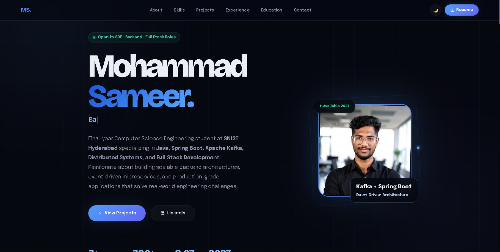

# 🚀 Mohammad Sameer – Software Engineer Portfolio

## 🌐 Portfolio Preview

  

### Backend Engineer • Full Stack Developer • Distributed Systems Enthusiast

Building scalable backend systems, event-driven architectures, and production-grade applications using Java, Spring Boot, Apache Kafka, and modern web technologies.

🌐 **Live Portfolio:** [Visit Portfolio](https://sameer-portfolio-gules.vercel.app)
---

## 👨‍💻 About Me

I'm a Final-Year Computer Science Engineering student at **Sreenidhi Institute of Science and Technology (SNIST), Hyderabad**.

My primary focus is backend engineering, distributed systems, microservices architecture, and full-stack development.

I enjoy designing systems that are scalable, reliable, and production-ready while continuously improving my problem-solving and software engineering skills.

---

## 🛠 Tech Stack

### Backend

- Java
- Spring Boot
- Spring Security
- REST APIs
- Apache Kafka
- Microservices
- Redis

### Frontend

- React.js
- JavaScript
- HTML5
- CSS3

### Database

- MySQL
- MongoDB

### Tools & Platforms

- Git
- GitHub
- Postman
- Docker
- Vercel

---

## ⭐ Featured Projects

### 🚀 Event-Driven Order Processing System

🔗 Repository: [View Project](https://github.com/Sameer07-web/event-driven-ecommerce-system)

- Spring Boot Microservices
- Apache Kafka Integration
- Asynchronous Communication
- Distributed Architecture
- Production-Style Backend Design

### 🤖 CareerMate AI Platform

🔗 Repository: [View Project](https://github.com/Sameer07-web/CareerMate-Platform)

- AI-Powered Career Guidance
- React Native Mobile Application
- Gemini API Integration
- Personalized Career Recommendations

### 🔐 AuthSphere IAM Platform

🔗 Repository: [View Project](https://github.com/Sameer07-web/authsphere-iam-platform)

- OAuth Authentication
- Multi-Factor Authentication (MFA)
- Role-Based Access Control (RBAC)
- Audit Logging
- Multi-Tenant Architecture
- Redis Session Management
---
---

## 🎯 Engineering Focus

These projects demonstrate practical experience in:

- Distributed Systems
- Event-Driven Architecture
- Authentication & Authorization
- REST API Development
- Full Stack Application Development
- Mobile Application Development
- Scalable Backend Engineering
- Production-Oriented Software Design

---
## 📈 Skills & Interests

- Backend Development
- Distributed Systems
- Event-Driven Architecture
- System Design
- API Development
- Full Stack Development
- Software Engineering

---

## 🧩 Problem Solving

- 300+ DSA Problems Solved
- Consistent Practice on LeetCode & MentorPick
- Strong Foundation in Data Structures & Algorithms
- Object-Oriented Programming
- Interview-Focused Problem Solving
---

## 🎓 Education

**B.Tech – Computer Science Engineering**

Sreenidhi Institute of Science and Technology (SNIST)

CGPA: **8.07**

Expected Graduation: **2027**

---

## 🌐 Portfolio Features

- Modern Responsive Design
- Dark & Light Theme
- Interactive UI Components
- Professional Project Showcase
- Experience & Education Timeline
- Resume Download
- Mobile-Friendly Layout

---

## 📫 Connect With Me

### LinkedIn

[LinkedIn Profile](https://www.linkedin.com/in/mohammadsameer007)

### GitHub

[GitHub Profile](https://github.com/Sameer07-web)

### Portfolio

[Portfolio Website](https://sameer-portfolio-gules.vercel.app)

---

### Thanks for visiting my portfolio repository ⭐

If you find the project interesting, feel free to star the repository.

